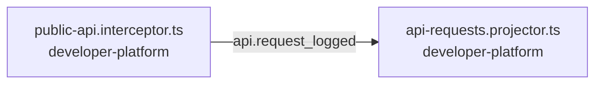

<!-- generated by scripts/docs - do not edit by hand; regenerate with `pnpm docs:generate` -->

# api-request-logged

> ⏳ _The AI-written parts of this page have not been generated yet; only facts extracted from the code are shown._

**Units:** domain/developer-platform

## Steps

| # | Hop | Producer | Consumer | What happens |
|---|---|---|---|---|
| 0 | event `api.request_logged` | [public-api.interceptor.ts](../../../packages/backend/libs/domains/developer-platform/api/public-api.interceptor.ts) | [api-requests.projector.ts](../../../packages/backend/libs/domains/developer-platform/infra/api-requests.projector.ts) |  |

## Likely entry points

_Request handlers whose files import (within two hops) code in this flow; a heuristic, not a trace._

- `GET /v1/products` in [v1.controller.ts](../../../packages/backend/libs/domains/developer-platform/api/v1.controller.ts#L68)
- `GET /v1/products/:id` in [v1.controller.ts](../../../packages/backend/libs/domains/developer-platform/api/v1.controller.ts#L77)
- `POST /v1/products` in [v1.controller.ts](../../../packages/backend/libs/domains/developer-platform/api/v1.controller.ts#L85)
- `PATCH /v1/products/:id` in [v1.controller.ts](../../../packages/backend/libs/domains/developer-platform/api/v1.controller.ts#L93)
- `GET /v1/products/:id/stock` in [v1.controller.ts](../../../packages/backend/libs/domains/developer-platform/api/v1.controller.ts#L101)
- `GET /v1/stock/:productId` in [v1.controller.ts](../../../packages/backend/libs/domains/developer-platform/api/v1.controller.ts#L108)
- `POST /v1/stock/bulk` in [v1.controller.ts](../../../packages/backend/libs/domains/developer-platform/api/v1.controller.ts#L116)
- `GET /v1/stock/bulk/:jobId` in [v1.controller.ts](../../../packages/backend/libs/domains/developer-platform/api/v1.controller.ts#L124)
- `GET /v1/orders` in [v1.controller.ts](../../../packages/backend/libs/domains/developer-platform/api/v1.controller.ts#L132)
- `GET /v1/orders/:id` in [v1.controller.ts](../../../packages/backend/libs/domains/developer-platform/api/v1.controller.ts#L140)
- `POST /v1/batch` in [v1.controller.ts](../../../packages/backend/libs/domains/developer-platform/api/v1.controller.ts#L153)
