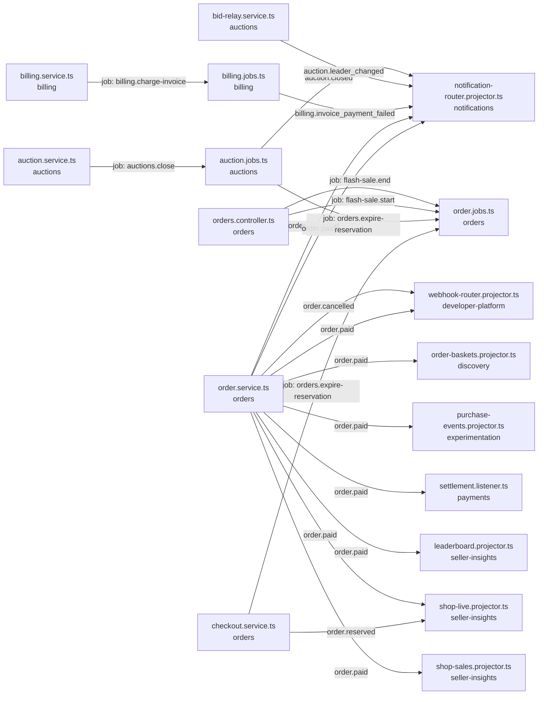

<!-- generated by scripts/docs - do not edit by hand; regenerate with `pnpm docs:generate` -->

# auction-closed

> ⏳ _The AI-written parts of this page have not been generated yet; only facts extracted from the code are shown._

**Units:** domain/auctions, domain/billing, domain/developer-platform, domain/discovery, domain/experimentation, domain/notifications, domain/orders, domain/payments, domain/seller-insights

## Steps

| # | Hop | Producer | Consumer | What happens |
|---|---|---|---|---|
| 0 | event `auction.closed` | [auction.jobs.ts](../../../packages/backend/libs/domains/auctions/infra/auction.jobs.ts) | [notification-router.projector.ts](../../../packages/backend/libs/domains/notifications/infra/notification-router.projector.ts) |  |
| 1 | event `auction.leader_changed` | [bid-relay.service.ts](../../../packages/backend/libs/domains/auctions/infra/bid-relay.service.ts) | [notification-router.projector.ts](../../../packages/backend/libs/domains/notifications/infra/notification-router.projector.ts) |  |
| 2 | job `auctions.close` | [auction.service.ts](../../../packages/backend/libs/domains/auctions/application/auction.service.ts) | [auction.jobs.ts](../../../packages/backend/libs/domains/auctions/infra/auction.jobs.ts) |  |
| 3 | job `billing.charge-invoice` | [billing.service.ts](../../../packages/backend/libs/domains/billing/application/billing.service.ts) | [billing.jobs.ts](../../../packages/backend/libs/domains/billing/infra/billing.jobs.ts) |  |
| 4 | event `billing.invoice_payment_failed` | [billing.jobs.ts](../../../packages/backend/libs/domains/billing/infra/billing.jobs.ts) | [notification-router.projector.ts](../../../packages/backend/libs/domains/notifications/infra/notification-router.projector.ts) |  |
| 5 | job `flash-sale.end` | [orders.controller.ts](../../../packages/backend/libs/domains/orders/api/orders.controller.ts) | [order.jobs.ts](../../../packages/backend/libs/domains/orders/infra/order.jobs.ts) |  |
| 6 | job `flash-sale.start` | [orders.controller.ts](../../../packages/backend/libs/domains/orders/api/orders.controller.ts) | [order.jobs.ts](../../../packages/backend/libs/domains/orders/infra/order.jobs.ts) |  |
| 7 | event `order.cancelled` | [order.service.ts](../../../packages/backend/libs/domains/orders/application/order.service.ts) | [webhook-router.projector.ts](../../../packages/backend/libs/domains/developer-platform/infra/webhook-router.projector.ts) |  |
| 8 | event `order.cancelled` | [order.service.ts](../../../packages/backend/libs/domains/orders/application/order.service.ts) | [notification-router.projector.ts](../../../packages/backend/libs/domains/notifications/infra/notification-router.projector.ts) |  |
| 9 | event `order.paid` | [order.service.ts](../../../packages/backend/libs/domains/orders/application/order.service.ts) | [webhook-router.projector.ts](../../../packages/backend/libs/domains/developer-platform/infra/webhook-router.projector.ts) |  |
| 10 | event `order.paid` | [order.service.ts](../../../packages/backend/libs/domains/orders/application/order.service.ts) | [order-baskets.projector.ts](../../../packages/backend/libs/domains/discovery/infra/order-baskets.projector.ts) |  |
| 11 | event `order.paid` | [order.service.ts](../../../packages/backend/libs/domains/orders/application/order.service.ts) | [purchase-events.projector.ts](../../../packages/backend/libs/domains/experimentation/infra/purchase-events.projector.ts) |  |
| 12 | event `order.paid` | [order.service.ts](../../../packages/backend/libs/domains/orders/application/order.service.ts) | [notification-router.projector.ts](../../../packages/backend/libs/domains/notifications/infra/notification-router.projector.ts) |  |
| 13 | event `order.paid` | [order.service.ts](../../../packages/backend/libs/domains/orders/application/order.service.ts) | [settlement.listener.ts](../../../packages/backend/libs/domains/payments/infra/settlement.listener.ts) ([Settling paid orders to shops](../concepts/domain-payments/settling-orders-to-shops.md)) |  |
| 14 | event `order.paid` | [order.service.ts](../../../packages/backend/libs/domains/orders/application/order.service.ts) | [leaderboard.projector.ts](../../../packages/backend/libs/domains/seller-insights/infra/leaderboard.projector.ts) |  |
| 15 | event `order.paid` | [order.service.ts](../../../packages/backend/libs/domains/orders/application/order.service.ts) | [shop-live.projector.ts](../../../packages/backend/libs/domains/seller-insights/infra/shop-live.projector.ts) |  |
| 16 | event `order.paid` | [order.service.ts](../../../packages/backend/libs/domains/orders/application/order.service.ts) | [shop-sales.projector.ts](../../../packages/backend/libs/domains/seller-insights/infra/shop-sales.projector.ts) |  |
| 17 | event `order.reserved` | [checkout.service.ts](../../../packages/backend/libs/domains/orders/application/checkout.service.ts) | [shop-live.projector.ts](../../../packages/backend/libs/domains/seller-insights/infra/shop-live.projector.ts) |  |
| 18 | job `orders.expire-reservation` | [auction.jobs.ts](../../../packages/backend/libs/domains/auctions/infra/auction.jobs.ts) | [order.jobs.ts](../../../packages/backend/libs/domains/orders/infra/order.jobs.ts) |  |
| 19 | job `orders.expire-reservation` | [checkout.service.ts](../../../packages/backend/libs/domains/orders/application/checkout.service.ts) | [order.jobs.ts](../../../packages/backend/libs/domains/orders/infra/order.jobs.ts) |  |

## Capabilities involved

- [Settling paid orders to shops](../concepts/domain-payments/settling-orders-to-shops.md) (domain/payments)

## Likely entry points

_Request handlers whose files import (within two hops) code in this flow; a heuristic, not a trace._

- `POST /shops/:shopId/auctions` in [auctions.controller.ts](../../../packages/backend/libs/domains/auctions/api/auctions.controller.ts#L22)
- `GET /auctions/:auctionId` in [auctions.controller.ts](../../../packages/backend/libs/domains/auctions/api/auctions.controller.ts#L32)
- `POST /auctions/:auctionId/bids` in [auctions.controller.ts](../../../packages/backend/libs/domains/auctions/api/auctions.controller.ts#L40)
- `GET /auctions/:auctionId/bids` in [auctions.controller.ts](../../../packages/backend/libs/domains/auctions/api/auctions.controller.ts#L47)
- `GET /plans` in [billing.controller.ts](../../../packages/backend/libs/domains/billing/api/billing.controller.ts#L19)
- `GET /shops/:shopId/subscription` in [billing.controller.ts](../../../packages/backend/libs/domains/billing/api/billing.controller.ts#L26)
- `POST /shops/:shopId/subscription` in [billing.controller.ts](../../../packages/backend/libs/domains/billing/api/billing.controller.ts#L32)
- `POST /shops/:shopId/subscription/preview` in [billing.controller.ts](../../../packages/backend/libs/domains/billing/api/billing.controller.ts#L39)
- `POST /shops/:shopId/subscription/change` in [billing.controller.ts](../../../packages/backend/libs/domains/billing/api/billing.controller.ts#L47)
- `POST /shops/:shopId/subscription/cancel` in [billing.controller.ts](../../../packages/backend/libs/domains/billing/api/billing.controller.ts#L54)
- `GET /shops/:shopId/invoices` in [billing.controller.ts](../../../packages/backend/libs/domains/billing/api/billing.controller.ts#L60)
- `GET /me/subscription` in [billing.controller.ts](../../../packages/backend/libs/domains/billing/api/billing.controller.ts#L67)
