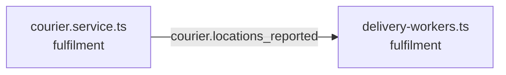

<!-- generated by scripts/docs - do not edit by hand; regenerate with `pnpm docs:generate` -->

# courier-locations-reported

> ⏳ _The AI-written parts of this page have not been generated yet; only facts extracted from the code are shown._

**Units:** domain/fulfilment

## Steps

| # | Hop | Producer | Consumer | What happens |
|---|---|---|---|---|
| 0 | event `courier.locations_reported` | [courier.service.ts](../../../packages/backend/libs/domains/fulfilment/application/courier.service.ts) | [delivery-workers.ts](../../../packages/backend/libs/domains/fulfilment/infra/delivery-workers.ts) |  |

## Likely entry points

_Request handlers whose files import (within two hops) code in this flow; a heuristic, not a trace._

- `POST /couriers/me` in [delivery.controller.ts](../../../packages/backend/libs/domains/fulfilment/api/delivery.controller.ts#L53)
- `PUT /couriers/me/availability` in [delivery.controller.ts](../../../packages/backend/libs/domains/fulfilment/api/delivery.controller.ts#L60)
- `POST /couriers/me/locations` in [delivery.controller.ts](../../../packages/backend/libs/domains/fulfilment/api/delivery.controller.ts#L67)
- `POST /shops/:shopId/deliveries` in [delivery.controller.ts](../../../packages/backend/libs/domains/fulfilment/api/delivery.controller.ts#L75)
- `GET /deliveries/:id` in [delivery.controller.ts](../../../packages/backend/libs/domains/fulfilment/api/delivery.controller.ts#L82)
- `POST /deliveries/:id/accept` in [delivery.controller.ts](../../../packages/backend/libs/domains/fulfilment/api/delivery.controller.ts#L91)
- `POST /deliveries/:id/decline` in [delivery.controller.ts](../../../packages/backend/libs/domains/fulfilment/api/delivery.controller.ts#L98)
- `POST /deliveries/:id/picked-up` in [delivery.controller.ts](../../../packages/backend/libs/domains/fulfilment/api/delivery.controller.ts#L105)
- `POST /deliveries/:id/delivered` in [delivery.controller.ts](../../../packages/backend/libs/domains/fulfilment/api/delivery.controller.ts#L112)
