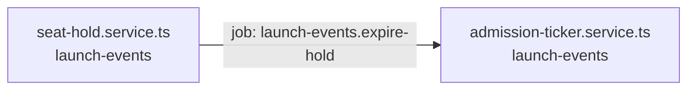

<!-- generated by scripts/docs - do not edit by hand; regenerate with `pnpm docs:generate` -->

# launch-events-expire-hold

> ⏳ _The AI-written parts of this page have not been generated yet; only facts extracted from the code are shown._

**Units:** domain/launch-events

## Steps

| # | Hop | Producer | Consumer | What happens |
|---|---|---|---|---|
| 0 | job `launch-events.expire-hold` | [seat-hold.service.ts](../../../packages/backend/libs/domains/launch-events/application/seat-hold.service.ts) | [admission-ticker.service.ts](../../../packages/backend/libs/domains/launch-events/infra/admission-ticker.service.ts) |  |

## Likely entry points

_Request handlers whose files import (within two hops) code in this flow; a heuristic, not a trace._

- `POST /shops/:shopId/launch-events` in [launch-events.controller.ts](../../../packages/backend/libs/domains/launch-events/api/launch-events.controller.ts#L24)
- `GET /launch-events/:eventId` in [launch-events.controller.ts](../../../packages/backend/libs/domains/launch-events/api/launch-events.controller.ts#L32)
- `POST /launch-events/:eventId/queue` in [launch-events.controller.ts](../../../packages/backend/libs/domains/launch-events/api/launch-events.controller.ts#L39)
- `GET /launch-events/:eventId/queue/:ticket` in [launch-events.controller.ts](../../../packages/backend/libs/domains/launch-events/api/launch-events.controller.ts#L47)
- `GET /launch-events/:eventId/seatmap` in [launch-events.controller.ts](../../../packages/backend/libs/domains/launch-events/api/launch-events.controller.ts#L55)
- `POST /launch-events/:eventId/holds` in [launch-events.controller.ts](../../../packages/backend/libs/domains/launch-events/api/launch-events.controller.ts#L61)
- `POST /launch-holds/:holdId/confirm` in [launch-events.controller.ts](../../../packages/backend/libs/domains/launch-events/api/launch-events.controller.ts#L75)
- `DELETE /launch-holds/:holdId` in [launch-events.controller.ts](../../../packages/backend/libs/domains/launch-events/api/launch-events.controller.ts#L81)
