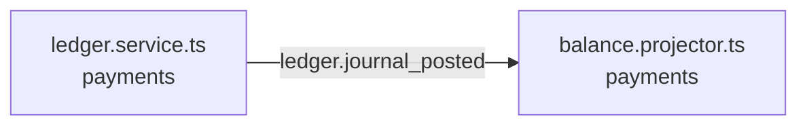

<!-- generated by scripts/docs - do not edit by hand; regenerate with `pnpm docs:generate` -->

# Ledger Journal Posting Updates Account Balances

A journal entry is posted to the payments ledger, which validates it as part of double-entry bookkeeping. Posting emits a `ledger.journal_posted` event. A balance projector consumes that event and applies the entry to account balances stored in Redis. The webhook endpoint POST /webhooks/stripe reaches this flow, and GET /shops/:`shopId`/balance and GET /shops/:`shopId`/payouts also reach it. These links come from import-based heuristics.

**Units:** domain/payments

## Steps

| # | Hop | Producer | Consumer | What happens |
|---|---|---|---|---|
| 0 | event `ledger.journal_posted` | [ledger.service.ts](../../../packages/backend/libs/domains/payments/application/ledger.service.ts) ([Recording money in the ledger](../concepts/domain-payments/recording-money-in-ledger.md)) | [balance.projector.ts](../../../packages/backend/libs/domains/payments/infra/balance.projector.ts) ([Shop balance and payout history reads](../concepts/domain-payments/shop-balance-read-model.md)) | After the ledger service posts a balanced journal entry, it emits `ledger.journal_posted`, and the balance projector applies the entry atomically to the Redis-backed account balances. |

## Capabilities involved

- [Recording money in the ledger](../concepts/domain-payments/recording-money-in-ledger.md) (domain/payments)
- [Shop balance and payout history reads](../concepts/domain-payments/shop-balance-read-model.md) (domain/payments)

## Notes

- The projector applies journal entries atomically to Redis balances.
- The ledger service validates balances for double-entry bookkeeping.
- Retry, ordering and idempotency behaviour for the event are not evident from the provided material.

## Likely entry points

_Request handlers whose files import (within two hops) code in this flow; a heuristic, not a trace._

- `POST /webhooks/stripe` in [stripe-webhook.controller.ts](../../../packages/backend/libs/domains/orders/api/stripe-webhook.controller.ts#L36)
- `GET /shops/:shopId/balance` in [finance.controller.ts](../../../packages/backend/libs/domains/payments/api/finance.controller.ts#L26)
- `GET /shops/:shopId/payouts` in [finance.controller.ts](../../../packages/backend/libs/domains/payments/api/finance.controller.ts#L36)
