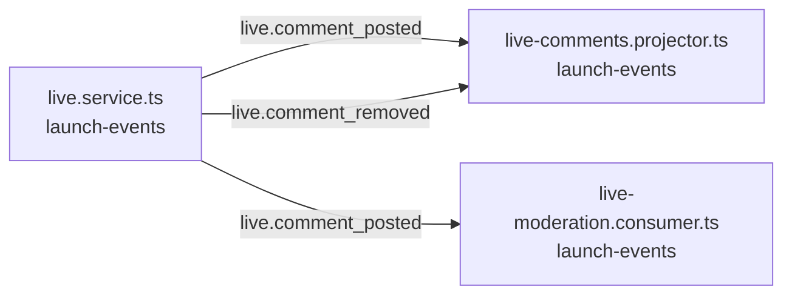

<!-- generated by scripts/docs - do not edit by hand; regenerate with `pnpm docs:generate` -->

# live-comment-posted

> ⏳ _The AI-written parts of this page have not been generated yet; only facts extracted from the code are shown._

**Units:** domain/launch-events

## Steps

| # | Hop | Producer | Consumer | What happens |
|---|---|---|---|---|
| 0 | event `live.comment_posted` | [live.service.ts](../../../packages/backend/libs/domains/launch-events/application/live.service.ts) | [live-comments.projector.ts](../../../packages/backend/libs/domains/launch-events/infra/live-comments.projector.ts) |  |
| 1 | event `live.comment_posted` | [live.service.ts](../../../packages/backend/libs/domains/launch-events/application/live.service.ts) | [live-moderation.consumer.ts](../../../packages/backend/libs/domains/launch-events/infra/live-moderation.consumer.ts) |  |
| 2 | event `live.comment_removed` | [live.service.ts](../../../packages/backend/libs/domains/launch-events/application/live.service.ts) | [live-comments.projector.ts](../../../packages/backend/libs/domains/launch-events/infra/live-comments.projector.ts) |  |

## Likely entry points

_Request handlers whose files import (within two hops) code in this flow; a heuristic, not a trace._

- `GET /live/:streamId/events` in [live-stream.controller.ts](../../../packages/backend/apps/sse-gateway/src/live/live-stream.controller.ts#L27)
- `POST /shops/:shopId/live` in [live.controller.ts](../../../packages/backend/libs/domains/launch-events/api/live.controller.ts#L39)
- `POST /shops/:shopId/live/:streamId/start` in [live.controller.ts](../../../packages/backend/libs/domains/launch-events/api/live.controller.ts#L45)
- `POST /shops/:shopId/live/:streamId/end` in [live.controller.ts](../../../packages/backend/libs/domains/launch-events/api/live.controller.ts#L51)
- `POST /live/:streamId/comments` in [live.controller.ts](../../../packages/backend/libs/domains/launch-events/api/live.controller.ts#L58)
- `POST /live/:streamId/reactions` in [live.controller.ts](../../../packages/backend/libs/domains/launch-events/api/live.controller.ts#L68)
- `GET /live/:streamId` in [live.controller.ts](../../../packages/backend/libs/domains/launch-events/api/live.controller.ts#L75)
- `PUT /live/:streamId/pin` in [live.controller.ts](../../../packages/backend/libs/domains/launch-events/api/live.controller.ts#L83)
- `DELETE /live/:streamId/pin` in [live.controller.ts](../../../packages/backend/libs/domains/launch-events/api/live.controller.ts#L90)
- `DELETE /live/:streamId/comments/:commentId` in [live.controller.ts](../../../packages/backend/libs/domains/launch-events/api/live.controller.ts#L98)
- `POST /live/:streamId/mutes/:userId` in [live.controller.ts](../../../packages/backend/libs/domains/launch-events/api/live.controller.ts#L106)
