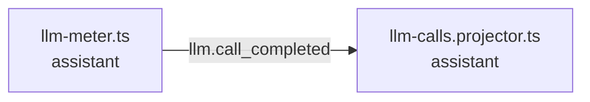

<!-- generated by scripts/docs - do not edit by hand; regenerate with `pnpm docs:generate` -->

# llm-call-completed

> ⏳ _The AI-written parts of this page have not been generated yet; only facts extracted from the code are shown._

**Units:** domain/assistant

## Steps

| # | Hop | Producer | Consumer | What happens |
|---|---|---|---|---|
| 0 | event `llm.call_completed` | [llm-meter.ts](../../../packages/backend/libs/domains/assistant/infra/llm/llm-meter.ts) | [llm-calls.projector.ts](../../../packages/backend/libs/domains/assistant/infra/llm-calls.projector.ts) |  |

## Likely entry points

_Request handlers whose files import (within two hops) code in this flow; a heuristic, not a trace._

- `POST /assistant/conversations` in [assistant.controller.ts](../../../packages/backend/libs/domains/assistant/api/assistant.controller.ts#L42)
- `GET /assistant/conversations` in [assistant.controller.ts](../../../packages/backend/libs/domains/assistant/api/assistant.controller.ts#L48)
- `GET /assistant/conversations/:id/messages` in [assistant.controller.ts](../../../packages/backend/libs/domains/assistant/api/assistant.controller.ts#L54)
- `GET /assistant/usage` in [assistant.controller.ts](../../../packages/backend/libs/domains/assistant/api/assistant.controller.ts#L60)
- `POST /assistant/conversations/:id/messages` in [assistant.controller.ts](../../../packages/backend/libs/domains/assistant/api/assistant.controller.ts#L73)
- `GET /assistant/messages/:messageId/stream` in [assistant.controller.ts](../../../packages/backend/libs/domains/assistant/api/assistant.controller.ts#L84)
- `POST /assistant/messages/:messageId/cancel` in [assistant.controller.ts](../../../packages/backend/libs/domains/assistant/api/assistant.controller.ts#L93)
- `POST /shops/:shopId/knowledge/documents` in [knowledge.controller.ts](../../../packages/backend/libs/domains/assistant/api/knowledge.controller.ts#L41)
- `POST /shops/:shopId/knowledge/documents/:documentId/uploaded` in [knowledge.controller.ts](../../../packages/backend/libs/domains/assistant/api/knowledge.controller.ts#L51)
- `GET /shops/:shopId/knowledge/documents` in [knowledge.controller.ts](../../../packages/backend/libs/domains/assistant/api/knowledge.controller.ts#L57)
- `DELETE /shops/:shopId/knowledge/documents/:documentId` in [knowledge.controller.ts](../../../packages/backend/libs/domains/assistant/api/knowledge.controller.ts#L64)
- `POST /admin/knowledge/documents` in [knowledge.controller.ts](../../../packages/backend/libs/domains/assistant/api/knowledge.controller.ts#L71)
