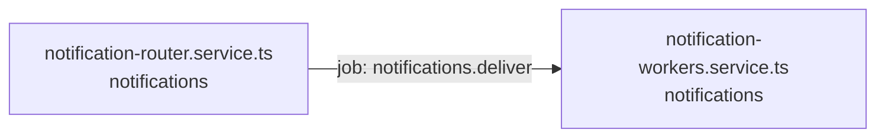

<!-- generated by scripts/docs - do not edit by hand; regenerate with `pnpm docs:generate` -->

# notifications-deliver

> ⏳ _The AI-written parts of this page have not been generated yet; only facts extracted from the code are shown._

**Units:** domain/notifications

## Steps

| # | Hop | Producer | Consumer | What happens |
|---|---|---|---|---|
| 0 | job `notifications.deliver` | [notification-router.service.ts](../../../packages/backend/libs/domains/notifications/application/notification-router.service.ts) | [notification-workers.service.ts](../../../packages/backend/libs/domains/notifications/infra/notification-workers.service.ts) |  |

## Likely entry points

_Request handlers whose files import (within two hops) code in this flow; a heuristic, not a trace._

- `POST /shops/:shopId/competitors` in [crawler.module.ts](../../../packages/backend/libs/domains/seller-insights/crawler.module.ts#L31)
