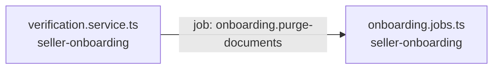

<!-- generated by scripts/docs - do not edit by hand; regenerate with `pnpm docs:generate` -->

# onboarding-purge-documents

> ⏳ _The AI-written parts of this page have not been generated yet; only facts extracted from the code are shown._

**Units:** domain/seller-onboarding

## Steps

| # | Hop | Producer | Consumer | What happens |
|---|---|---|---|---|
| 0 | job `onboarding.purge-documents` | [verification.service.ts](../../../packages/backend/libs/domains/seller-onboarding/application/verification.service.ts) | [onboarding.jobs.ts](../../../packages/backend/libs/domains/seller-onboarding/infra/onboarding.jobs.ts) |  |

## Likely entry points

_Request handlers whose files import (within two hops) code in this flow; a heuristic, not a trace._

- `PUT /shops/:shopId/onboarding/steps/:step` in [onboarding.controller.ts](../../../packages/backend/libs/domains/seller-onboarding/api/onboarding.controller.ts#L34)
- `GET /shops/:shopId/onboarding` in [onboarding.controller.ts](../../../packages/backend/libs/domains/seller-onboarding/api/onboarding.controller.ts#L40)
- `POST /shops/:shopId/onboarding/submit` in [onboarding.controller.ts](../../../packages/backend/libs/domains/seller-onboarding/api/onboarding.controller.ts#L47)
- `POST /shops/:shopId/onboarding/documents` in [onboarding.controller.ts](../../../packages/backend/libs/domains/seller-onboarding/api/onboarding.controller.ts#L53)
- `POST /shops/:shopId/onboarding/documents/:documentId/uploaded` in [onboarding.controller.ts](../../../packages/backend/libs/domains/seller-onboarding/api/onboarding.controller.ts#L60)
- `GET /admin/onboarding/reviews` in [onboarding.controller.ts](../../../packages/backend/libs/domains/seller-onboarding/api/onboarding.controller.ts#L72)
- `POST /admin/onboarding/reviews/:taskId/resolve` in [onboarding.controller.ts](../../../packages/backend/libs/domains/seller-onboarding/api/onboarding.controller.ts#L79)
