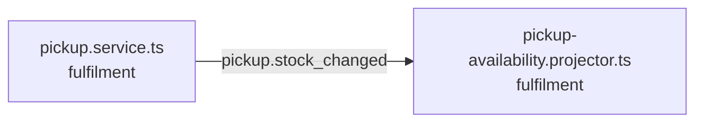

<!-- generated by scripts/docs - do not edit by hand; regenerate with `pnpm docs:generate` -->

# pickup-stock-changed

> ⏳ _The AI-written parts of this page have not been generated yet; only facts extracted from the code are shown._

**Units:** domain/fulfilment

## Steps

| # | Hop | Producer | Consumer | What happens |
|---|---|---|---|---|
| 0 | event `pickup.stock_changed` | [pickup.service.ts](../../../packages/backend/libs/domains/fulfilment/application/pickup.service.ts) | [pickup-availability.projector.ts](../../../packages/backend/libs/domains/fulfilment/infra/pickup-availability.projector.ts) |  |

## Likely entry points

_Request handlers whose files import (within two hops) code in this flow; a heuristic, not a trace._

- `POST /shops/:shopId/pickup-points` in [pickup.controller.ts](../../../packages/backend/libs/domains/fulfilment/api/pickup.controller.ts#L39)
- `PUT /shops/:shopId/pickup-points/:pointId/stock/:productId` in [pickup.controller.ts](../../../packages/backend/libs/domains/fulfilment/api/pickup.controller.ts#L45)
- `GET /search/near` in [pickup.controller.ts](../../../packages/backend/libs/domains/fulfilment/api/pickup.controller.ts#L58)
- `GET /pickup-points/near` in [pickup.controller.ts](../../../packages/backend/libs/domains/fulfilment/api/pickup.controller.ts#L66)
- `GET /pickup-points/clusters` in [pickup.controller.ts](../../../packages/backend/libs/domains/fulfilment/api/pickup.controller.ts#L73)
