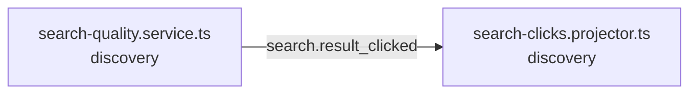

<!-- generated by scripts/docs - do not edit by hand; regenerate with `pnpm docs:generate` -->

# search-result-clicked

> ⏳ _The AI-written parts of this page have not been generated yet; only facts extracted from the code are shown._

**Units:** domain/discovery

## Steps

| # | Hop | Producer | Consumer | What happens |
|---|---|---|---|---|
| 0 | event `search.result_clicked` | [search-quality.service.ts](../../../packages/backend/libs/domains/discovery/application/search-quality.service.ts) | [search-clicks.projector.ts](../../../packages/backend/libs/domains/discovery/infra/search-clicks.projector.ts) |  |

## Likely entry points

_Request handlers whose files import (within two hops) code in this flow; a heuristic, not a trace._

- `GET /products/search` in [product.controller.ts](../../../packages/backend/libs/domains/catalog/api/product.controller.ts#L32)
- `GET /products/:id` in [product.controller.ts](../../../packages/backend/libs/domains/catalog/api/product.controller.ts#L47)
- `POST /products/shops/:shopId` in [product.controller.ts](../../../packages/backend/libs/domains/catalog/api/product.controller.ts#L62)
- `POST /products` in [product.controller.ts](../../../packages/backend/libs/domains/catalog/api/product.controller.ts#L68)
- `GET /shops/:shopId/products/search` in [search-admin.controller.ts](../../../packages/backend/libs/domains/discovery/api/search-admin.controller.ts#L39)
- `POST /search/clicks` in [search-admin.controller.ts](../../../packages/backend/libs/domains/discovery/api/search-admin.controller.ts#L46)
- `GET /admin/search/quality` in [search-admin.controller.ts](../../../packages/backend/libs/domains/discovery/api/search-admin.controller.ts#L52)
- `PUT /admin/search/synonyms` in [search-admin.controller.ts](../../../packages/backend/libs/domains/discovery/api/search-admin.controller.ts#L59)
- `POST /admin/search/reindex` in [search-admin.controller.ts](../../../packages/backend/libs/domains/discovery/api/search-admin.controller.ts#L67)
