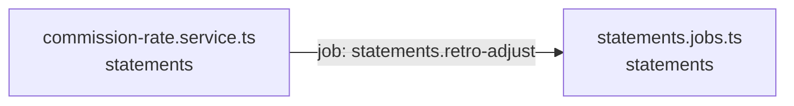

<!-- generated by scripts/docs - do not edit by hand; regenerate with `pnpm docs:generate` -->

# statements-retro-adjust

> ⏳ _The AI-written parts of this page have not been generated yet; only facts extracted from the code are shown._

**Units:** domain/statements

## Steps

| # | Hop | Producer | Consumer | What happens |
|---|---|---|---|---|
| 0 | job `statements.retro-adjust` | [commission-rate.service.ts](../../../packages/backend/libs/domains/statements/application/commission-rate.service.ts) | [statements.jobs.ts](../../../packages/backend/libs/domains/statements/infra/statements.jobs.ts) |  |

## Likely entry points

_Request handlers whose files import (within two hops) code in this flow; a heuristic, not a trace._

- `GET /shops/:shopId/statements/:month` in [statements.controller.ts](../../../packages/backend/libs/domains/statements/api/statements.controller.ts#L26)
- `GET /shops/:shopId/statements/:month/lines.csv` in [statements.controller.ts](../../../packages/backend/libs/domains/statements/api/statements.controller.ts#L37)
- `POST /admin/commission-rates` in [statements.controller.ts](../../../packages/backend/libs/domains/statements/api/statements.controller.ts#L47)
- `GET /admin/commission-rates` in [statements.controller.ts](../../../packages/backend/libs/domains/statements/api/statements.controller.ts#L53)
