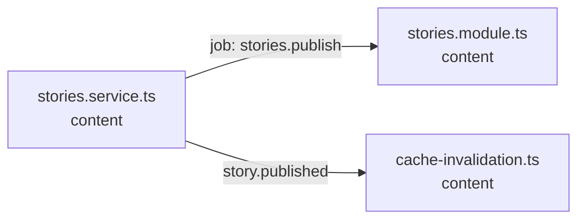

<!-- generated by scripts/docs - do not edit by hand; regenerate with `pnpm docs:generate` -->

# stories-publish

> ⏳ _The AI-written parts of this page have not been generated yet; only facts extracted from the code are shown._

**Units:** domain/content

## Steps

| # | Hop | Producer | Consumer | What happens |
|---|---|---|---|---|
| 0 | job `stories.publish` | [stories.service.ts](../../../packages/backend/libs/domains/content/application/stories.service.ts) | [stories.module.ts](../../../packages/backend/libs/domains/content/stories.module.ts) |  |
| 1 | event `story.published` | [stories.service.ts](../../../packages/backend/libs/domains/content/application/stories.service.ts) | [cache-invalidation.ts](../../../packages/backend/libs/domains/content/infra/cache-invalidation.ts) |  |

## Likely entry points

_Request handlers whose files import (within two hops) code in this flow; a heuristic, not a trace._

- `POST /shops/:shopId/stories` in [stories.controller.ts](../../../packages/backend/libs/domains/content/api/stories.controller.ts#L36)
- `PUT /shops/:shopId/stories/:storyId/drafts/:locale` in [stories.controller.ts](../../../packages/backend/libs/domains/content/api/stories.controller.ts#L42)
- `POST /shops/:shopId/stories/:storyId/publish` in [stories.controller.ts](../../../packages/backend/libs/domains/content/api/stories.controller.ts#L49)
- `POST /shops/:shopId/stories/:storyId/preview-token` in [stories.controller.ts](../../../packages/backend/libs/domains/content/api/stories.controller.ts#L55)
- `GET /stories/:shopSlug/:slug` in [stories.controller.ts](../../../packages/backend/libs/domains/content/api/stories.controller.ts#L67)
- `GET /stories/preview` in [stories.controller.ts](../../../packages/backend/libs/domains/content/api/stories.controller.ts#L81)
- `GET /sitemaps/stories.xml` in [stories.controller.ts](../../../packages/backend/libs/domains/content/api/stories.controller.ts#L89)
- `GET /sitemaps/stories-:page.xml` in [stories.controller.ts](../../../packages/backend/libs/domains/content/api/stories.controller.ts#L106)
