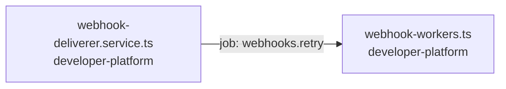

<!-- generated by scripts/docs - do not edit by hand; regenerate with `pnpm docs:generate` -->

# webhooks-retry

> ⏳ _The AI-written parts of this page have not been generated yet; only facts extracted from the code are shown._

**Units:** domain/developer-platform

## Steps

| # | Hop | Producer | Consumer | What happens |
|---|---|---|---|---|
| 0 | job `webhooks.retry` | [webhook-deliverer.service.ts](../../../packages/backend/libs/domains/developer-platform/application/webhook-deliverer.service.ts) | [webhook-workers.ts](../../../packages/backend/libs/domains/developer-platform/infra/webhook-workers.ts) |  |

## Likely entry points

_Request handlers whose files import (within two hops) code in this flow; a heuristic, not a trace._

- `POST /shops/:shopId/developers/webhooks` in [webhooks.controller.ts](../../../packages/backend/libs/domains/developer-platform/api/webhooks.controller.ts#L35)
- `GET /shops/:shopId/developers/webhooks` in [webhooks.controller.ts](../../../packages/backend/libs/domains/developer-platform/api/webhooks.controller.ts#L41)
- `PATCH /shops/:shopId/developers/webhooks/:id` in [webhooks.controller.ts](../../../packages/backend/libs/domains/developer-platform/api/webhooks.controller.ts#L47)
- `POST /shops/:shopId/developers/webhooks/:id/rotate-secret` in [webhooks.controller.ts](../../../packages/backend/libs/domains/developer-platform/api/webhooks.controller.ts#L54)
- `DELETE /shops/:shopId/developers/webhooks/:id` in [webhooks.controller.ts](../../../packages/backend/libs/domains/developer-platform/api/webhooks.controller.ts#L60)
- `GET /shops/:shopId/developers/webhooks/:id/attempts` in [webhooks.controller.ts](../../../packages/backend/libs/domains/developer-platform/api/webhooks.controller.ts#L67)
- `POST /shops/:shopId/developers/webhooks/:id/events/:eventId/replay` in [webhooks.controller.ts](../../../packages/backend/libs/domains/developer-platform/api/webhooks.controller.ts#L74)
- `POST /shops/:shopId/developers/webhooks/ping` in [webhooks.controller.ts](../../../packages/backend/libs/domains/developer-platform/api/webhooks.controller.ts#L81)
