<!-- generated by scripts/docs - do not edit by hand; regenerate with `pnpm docs:generate` -->

# System overview

> ⏳ _The AI-written parts of this page have not been generated yet; only facts extracted from the code are shown._

## Deployables and what they host

| App | Pulls in |
|---|---|
| [app/bff](units/app/bff.md) | bff, platform |
| [app/collab](units/app/collab.md) | catalog, tenancy, database, platform, redis |
| [app/core](units/app/core.md) | asset-library, assistant, auctions, billing, catalog, catalog-sync, chat, community, content, developer-platform, discovery, experimentation, fulfilment, identity, launch-events, marketing, media, notifications, orders, payments, seller-insights, seller-onboarding, shop-functions, statements, tenancy, cache, clickhouse, database, dynamo, outbox, platform, rate-limit, redis |
| [app/lambda-local](units/app/lambda-local.md) | lambdas |
| [app/lambdas](units/app/lambdas.md) | assistant, developer-platform, media, seller-onboarding, database, platform, redis |
| [app/local-monolith](units/app/local-monolith.md) | bff, collab, core, projector, public-api, sse-gateway, worker, platform |
| [app/payment-processor](units/app/payment-processor.md) | payments, lifecycle |
| [app/projector](units/app/projector.md) | assistant, billing, catalog, catalog-sync, chat, community, content, developer-platform, discovery, experimentation, fulfilment, launch-events, marketing, notifications, payments, seller-insights, tenancy, cache, cassandra, clickhouse, database, dynamo, elasticsearch, kafka, platform, projections, redis, sqs |
| [app/public-api](units/app/public-api.md) | developer-platform, tenancy, database, platform, rate-limit, redis |
| [app/sse-gateway](units/app/sse-gateway.md) | assistant, auctions, catalog-sync, chat, experimentation, fulfilment, identity, launch-events, orders, payments, tenancy, cache, database, dynamo, jobs, lifecycle, platform, rate-limit, realtime, redis, sqs, storage |
| [app/worker](units/app/worker.md) | asset-library, assistant, auctions, billing, catalog, catalog-sync, chat, community, content, developer-platform, discovery, experimentation, fulfilment, identity, launch-events, marketing, media, notifications, orders, payments, seller-insights, seller-onboarding, shop-functions, statements, tenancy, database, jobs, platform, redis, sqs |

## Domain dependencies

_An arrow means "imports from"; the number is how many import statements. Strongest links only._

```mermaid
flowchart LR
  packages_backend_libs_domains_developer_platform["developer-platform"] -->|8| packages_backend_libs_domains_identity["identity"]
  packages_backend_libs_domains_discovery["discovery"] -->|8| packages_backend_libs_domains_identity["identity"]
  packages_backend_libs_domains_catalog["catalog"] -->|7| packages_backend_libs_domains_identity["identity"]
  packages_backend_libs_domains_chat["chat"] -->|7| packages_backend_libs_domains_identity["identity"]
  packages_backend_libs_domains_tenancy["tenancy"] -->|7| packages_backend_libs_domains_identity["identity"]
  packages_backend_libs_domains_catalog_sync["catalog-sync"] -->|6| packages_backend_libs_domains_identity["identity"]
  packages_backend_libs_domains_launch_events["launch-events"] -->|6| packages_backend_libs_domains_identity["identity"]
  packages_backend_libs_domains_orders["orders"] -->|6| packages_backend_libs_domains_payments["payments"]
  packages_backend_libs_domains_discovery["discovery"] -->|5| packages_backend_libs_domains_catalog["catalog"]
  packages_backend_libs_domains_payments["payments"] -->|5| packages_backend_libs_domains_orders["orders"]
  packages_backend_libs_domains_seller_insights["seller-insights"] -->|5| packages_backend_libs_domains_identity["identity"]
  packages_backend_libs_domains_assistant["assistant"] -->|4| packages_backend_libs_domains_billing["billing"]
  packages_backend_libs_domains_assistant["assistant"] -->|4| packages_backend_libs_domains_identity["identity"]
  packages_backend_libs_domains_community["community"] -->|4| packages_backend_libs_domains_identity["identity"]
  packages_backend_libs_domains_experimentation["experimentation"] -->|4| packages_backend_libs_domains_identity["identity"]
  packages_backend_libs_domains_fulfilment["fulfilment"] -->|4| packages_backend_libs_domains_identity["identity"]
  packages_backend_libs_domains_marketing["marketing"] -->|4| packages_backend_libs_domains_identity["identity"]
  packages_backend_libs_domains_media["media"] -->|4| packages_backend_libs_domains_identity["identity"]
  packages_backend_libs_domains_orders["orders"] -->|4| packages_backend_libs_domains_catalog["catalog"]
  packages_backend_libs_domains_orders["orders"] -->|4| packages_backend_libs_domains_identity["identity"]
  packages_backend_libs_domains_payments["payments"] -->|4| packages_backend_libs_domains_identity["identity"]
  packages_backend_libs_domains_seller_onboarding["seller-onboarding"] -->|4| packages_backend_libs_domains_identity["identity"]
  packages_backend_libs_domains_catalog["catalog"] -->|3| packages_backend_libs_domains_tenancy["tenancy"]
  packages_backend_libs_domains_catalog_sync["catalog-sync"] -->|3| packages_backend_libs_domains_orders["orders"]
  packages_backend_libs_domains_catalog_sync["catalog-sync"] -->|3| packages_backend_libs_domains_tenancy["tenancy"]
  packages_backend_libs_domains_chat["chat"] -->|3| packages_backend_libs_domains_catalog["catalog"]
  packages_backend_libs_domains_developer_platform["developer-platform"] -->|3| packages_backend_libs_domains_catalog["catalog"]
  packages_backend_libs_domains_developer_platform["developer-platform"] -->|3| packages_backend_libs_domains_tenancy["tenancy"]
  packages_backend_libs_domains_launch_events["launch-events"] -->|3| packages_backend_libs_domains_tenancy["tenancy"]
  packages_backend_libs_domains_payments["payments"] -->|3| packages_backend_libs_domains_tenancy["tenancy"]
  packages_backend_libs_domains_seller_insights["seller-insights"] -->|3| packages_backend_libs_domains_orders["orders"]
  packages_backend_libs_domains_seller_onboarding["seller-onboarding"] -->|3| packages_backend_libs_domains_assistant["assistant"]
  packages_backend_libs_domains_asset_library["asset-library"] -->|2| packages_backend_libs_domains_identity["identity"]
  packages_backend_libs_domains_assistant["assistant"] -->|2| packages_backend_libs_domains_catalog["catalog"]
  packages_backend_libs_domains_assistant["assistant"] -->|2| packages_backend_libs_domains_fulfilment["fulfilment"]
  packages_backend_libs_domains_auctions["auctions"] -->|2| packages_backend_libs_domains_billing["billing"]
  packages_backend_libs_domains_auctions["auctions"] -->|2| packages_backend_libs_domains_identity["identity"]
  packages_backend_libs_domains_auctions["auctions"] -->|2| packages_backend_libs_domains_orders["orders"]
  packages_backend_libs_domains_auctions["auctions"] -->|2| packages_backend_libs_domains_tenancy["tenancy"]
  packages_backend_libs_domains_billing["billing"] -->|2| packages_backend_libs_domains_identity["identity"]
  packages_backend_libs_domains_chat["chat"] -->|2| packages_backend_libs_domains_notifications["notifications"]
  packages_backend_libs_domains_content["content"] -->|2| packages_backend_libs_domains_identity["identity"]
  packages_backend_libs_domains_developer_platform["developer-platform"] -->|2| packages_backend_libs_domains_notifications["notifications"]
  packages_backend_libs_domains_fulfilment["fulfilment"] -->|2| packages_backend_libs_domains_tenancy["tenancy"]
  packages_backend_libs_domains_marketing["marketing"] -->|2| packages_backend_libs_domains_payments["payments"]
  packages_backend_libs_domains_media["media"] -->|2| packages_backend_libs_domains_tenancy["tenancy"]
  packages_backend_libs_domains_notifications["notifications"] -->|2| packages_backend_libs_domains_identity["identity"]
  packages_backend_libs_domains_orders["orders"] -->|2| packages_backend_libs_domains_tenancy["tenancy"]
  packages_backend_libs_domains_seller_insights["seller-insights"] -->|2| packages_backend_libs_domains_catalog["catalog"]
  packages_backend_libs_domains_seller_insights["seller-insights"] -->|2| packages_backend_libs_domains_notifications["notifications"]
  packages_backend_libs_domains_seller_insights["seller-insights"] -->|2| packages_backend_libs_domains_tenancy["tenancy"]
  packages_backend_libs_domains_shop_functions["shop-functions"] -->|2| packages_backend_libs_domains_orders["orders"]
  packages_backend_libs_domains_statements["statements"] -->|2| packages_backend_libs_domains_identity["identity"]
  packages_backend_libs_domains_asset_library["asset-library"] -->|1| packages_backend_libs_domains_tenancy["tenancy"]
  packages_backend_libs_domains_assistant["assistant"] -->|1| packages_backend_libs_domains_tenancy["tenancy"]
  packages_backend_libs_domains_billing["billing"] -->|1| packages_backend_libs_domains_tenancy["tenancy"]
  packages_backend_libs_domains_catalog["catalog"] -->|1| packages_backend_libs_domains_discovery["discovery"]
  packages_backend_libs_domains_community["community"] -->|1| packages_backend_libs_domains_catalog["catalog"]
  packages_backend_libs_domains_content["content"] -->|1| packages_backend_libs_domains_tenancy["tenancy"]
  packages_backend_libs_domains_developer_platform["developer-platform"] -->|1| packages_backend_libs_domains_orders["orders"]
```

## Async flows

- [api-request-logged](flows/api-request-logged.md)
- [auction-closed](flows/auction-closed.md)
- [courier-locations-reported](flows/courier-locations-reported.md)
- [launch-events-expire-hold](flows/launch-events-expire-hold.md)
- [Ledger Journal Posting Updates Account Balances](flows/ledger-journal-posted.md)
- [live-comment-posted](flows/live-comment-posted.md)
- [llm-call-completed](flows/llm-call-completed.md)
- [notifications-deliver](flows/notifications-deliver.md)
- [onboarding-purge-documents](flows/onboarding-purge-documents.md)
- [pickup-stock-changed](flows/pickup-stock-changed.md)
- [search-performed](flows/search-performed.md)
- [search-reindex-products](flows/search-reindex-products.md)
- [search-result-clicked](flows/search-result-clicked.md)
- [statements-retro-adjust](flows/statements-retro-adjust.md)
- [stories-publish](flows/stories-publish.md)
- [webhooks-retry](flows/webhooks-retry.md)
